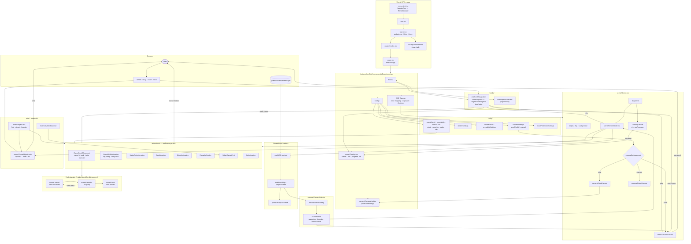

# Desert Portfolio — Master Codebase Flow

```mermaid
flowchart TB
    subgraph Browser["Browser"]
        USER([User])
        EVENTS["Wheel · Drag · Touch · Click"]
        GLB[("public/Models/Modelv1.glb")]
    end

    subgraph Remix["Remix SPA — app/"]
        ENTRY["entry.client.tsx<br/>hydrateRoot → RemixBrowser"]
        ROOT["root.tsx"]
        LAYOUT["layout.tsx<br/>globals.css · Meta · Links"]
        ROUTE["routes/_index.tsx"]
        PAGE["page.tsx<br/>meta + Page"]
        INSPECT_APP["useInspectProtection<br/>(app shell)"]
    end

    subgraph Experience["features/portfolio/components/Experience.tsx"]
        HOOKS["hooks/"]
        CONFIG["config/"]
        CANVAS["R3F Canvas<br/>tone mapping · exposure · shadows"]
        OVERLAY["scene/Overlay.tsx<br/>loader · hint · progress bar"]
        HUD["camera/CameraHud.tsx<br/>(orbit mode only)"]
    end

    subgraph Hooks["hooks/"]
        SCROLL_NAV["useScrollNavigation<br/>scrollProgress 0–1<br/>targetScrollProgress<br/>lerpFactor"]
        INSPECT_EXP["useInspectProtection<br/>(experience)"]
    end

    subgraph Config["config/"]
        CAM_CFG["cameraSettings<br/>scroll | orbit | manual"]
        REN_CFG["renderSettings"]
        ASSET_CFG["assetNames · sceneLinkSettings"]
        ANIM_CFG["camelScroll · camelWalk · metro · car<br/>cloud · campfire · safari · ain"]
        PROT_CFG["assetProtectionSettings"]
    end

    subgraph Scene["scene/Scene.tsx"]
        LIGHTS["Lights · fog · background"]
        CAM_MODE{cameraSettings.mode}
        SCROLL_CAM["camera/ScrollCamera"]
        ORBIT_CAM["camera/OrbitCamera"]
        FIXED_CAM["camera/FixedCamera"]
        SUSPENSE["Suspense"]
        LOADER["LoadingTracker<br/>drei useProgress"]
        DESERT["scene/DesertModel.tsx"]
    end

    subgraph CameraPath["camera/CameraPath.tsx"]
        EXTRACT["extractSceneFrame()"]
        SF["SceneFrame<br/>waypoints · bounds · lookAtCenter"]
    end

    subgraph DesertModel["DesertModel runtime"]
        GLTF["useGLTF preload"]
        NODES["buildNodeMap · prepareScene"]
        PRIMITIVE["primitive object=scene"]
    end

    subgraph Animations["animations/ — useFrame per tick"]
        CSM["CamelScrollMovement<br/>camel X track · turtle transfer"]
        CWA["CamelWalkAnimation<br/>leg swing · body rock"]
        METRO["MetroTrainAnimation"]
        CAR["CarAnimation"]
        CLOUD["CloudAnimation"]
        SMOKE["CampfireSmoke"]
        WIND["SafariCampWind"]
        AIN["AinAnimation"]
    end

    subgraph TurtleFlow["Turtle transfer (inside CamelScrollMovement)"]
        ON_CAMEL["mount: camel<br/>turtle on carrier"]
        ARC["mount: transfer<br/>arc jump"]
        ON_BOAT["mount: boat<br/>turtle seated"]
    end

    subgraph Utils["utils/ · materials/"]
        SCENE_UTIL["sceneObjectUtils<br/>find · attach · bounds"]
        WIND_MAT["materials/WindMaterial"]
        LINKS["scene/SceneObjectLinks<br/>raycast → open URL"]
    end

    USER --> EVENTS
    EVENTS --> SCROLL_NAV
    EVENTS --> LINKS

    ENTRY --> ROOT --> LAYOUT --> ROUTE --> PAGE
    LAYOUT --> INSPECT_APP
    PAGE --> Experience

    Experience --> HOOKS
    Experience --> CONFIG
    Experience --> CANVAS
    Experience --> OVERLAY
    Experience --> HUD

    HOOKS --> SCROLL_NAV
    HOOKS --> INSPECT_EXP
    CONFIG --> CAM_CFG
    CONFIG --> REN_CFG
    CONFIG --> ASSET_CFG
    CONFIG --> ANIM_CFG
    CONFIG --> PROT_CFG

    CANVAS --> Scene
    SCROLL_NAV -->|"refs"| SCROLL_CAM
    SCROLL_NAV -->|"refs"| DESERT
    SCROLL_NAV --> OVERLAY
    CAM_CFG --> CAM_MODE

    CAM_MODE -->|scroll| SCROLL_CAM
    CAM_MODE -->|orbit| ORBIT_CAM
    CAM_MODE -->|manual| FIXED_CAM
    ORBIT_CAM --> HUD

    SUSPENSE --> LOADER
    SUSPENSE --> DESERT
    LOADER -->|"onReady"| OVERLAY

    GLB --> GLTF
    DESERT --> GLTF --> NODES --> PRIMITIVE
    NODES --> EXTRACT --> SF
    SF --> SCROLL_CAM
    SF --> DESERT

    DESERT --> Animations
    DESERT --> LINKS
    ANIM_CFG --> Animations
    SCENE_UTIL --> Animations
    SCENE_UTIL --> LINKS
    WIND_MAT --> WIND

    CSM --> TurtleFlow
    ON_CAMEL --> ARC --> ON_BOAT
    ARC -.->|"scroll back"| ON_CAMEL

    SCROLL_NAV -->|"each frame"| SCROLL_CAM
    SCROLL_NAV -->|"each frame"| Animations
    SCROLL_CAM -->|"camera X"| USER
    Animations -->|"scene motion"| USER
    LINKS -->|"click"| USER
```
