# Desert Portfolio — Master Codebase Flow

> Remix SPA (`ssr: false`) + React Three Fiber. App shell in `app/`; portfolio feature code in `features/portfolio/`.

```mermaid
flowchart TB
    subgraph Browser["Browser"]
        USER([User])
        EVENTS["Wheel · Drag · Touch · Click · Pointer"]
        GLB[("public/Models/Modelv1.glb")]
        AUDIO_ASSETS[("public/Audios/*.mp3")]
        VIDEO_ASSETS[("public/Videos/*")]
    end

    subgraph Remix["Remix SPA — app/"]
        ENTRY["entry.client.tsx<br/>hydrateRoot → RemixBrowser"]
        ROOT["root.tsx"]
        LAYOUT["layout.tsx<br/>globals.css · Meta · Links"]
        ROUTE["routes/_index.tsx"]
        PAGE["page.tsx<br/>meta + Page"]
        INSPECT_APP["useInspectProtection<br/>(app shell)"]
    end

    subgraph Experience["features/portfolio/components/Experience.tsx"]
        HOOKS["hooks/"]
        CONFIG["config/"]
        CANVAS["R3F Canvas<br/>ACES tone mapping · exposure · shadows"]
        LOADER_SEL["loading/LoaderSelector.tsx"]
        OVERLAY["scene/Overlay.tsx<br/>scroll hint · progress bar"]
        AUDIO_UI["ui/AudioToggle.tsx"]
        HUD["camera/CameraHud.tsx<br/>(orbit mode only)"]
        HANDHELD["useIsHandheld<br/>fullscreen notice · tilt prompt"]
        SAFARI_VID_UI["DesertSafariVideoOverlay"]
    end

    subgraph LoaderSystem["loading/ — loaderSettings.activeLoader"]
        LS_CFG["config/loaderSettings.ts<br/>loader1 … loader6"]
        L1["loader1 · PortfolioLoader"]
        L2["loader2 · MinimalLoader"]
        L3["loader3 · FreakyLoader"]
        L4["loader4 · SpyltLoader"]
        L5["loader5 · AuroraLoader"]
        L6["loader6 · DonLoader"]
    end

    subgraph Hooks["hooks/"]
        SCROLL_NAV["useScrollNavigation<br/>scrollProgress 0–1<br/>isScrollLocked<br/>handheld horizontal swipe"]
        PORT_AUDIO["usePortfolioAudio"]
        DEVICE["useDeviceType · useIsHandheld"]
        INSPECT_EXP["useInspectProtection"]
    end

    subgraph Config["config/"]
        CAM_CFG["cameraSettings<br/>scroll | orbit | manual"]
        REN_CFG["renderSettings"]
        LOAD_CFG["loaderSettings"]
        AUDIO_CFG["audioSettings"]
        ASSET_CFG["assetNames · sceneLinkSettings"]
        SCROLL_CFG["camel · boat · car · jetski<br/>yacht · plane · endCamel scroll"]
        ANIM_CFG["camelWalk · metro · car · cloud<br/>bird · campfire · safari · ain · lantern · drone"]
        VIDEO_CFG["burjKhalifaVideo · desertSafariVideo"]
        STATE_CFG["carPassState"]
        JOURNEY_CFG["journeySettings"]
    end

    subgraph Scene["scene/Scene.tsx"]
        LIGHTS["Lights · fog · background"]
        CAM_MODE{cameraSettings.mode}
        SCROLL_CAM["camera/ScrollCamera"]
        ORBIT_CAM["camera/OrbitCamera"]
        FIXED_CAM["camera/FixedCamera"]
        SUSPENSE["Suspense"]
        LOADER_TRACK["LoadingTracker"]
        DESERT["scene/DesertModel.tsx"]
    end

    subgraph CameraPath["camera/CameraPath.tsx"]
        EXTRACT["extractSceneFrame()"]
        SF["SceneFrame<br/>waypoints · bounds · lookAtCenter"]
    end

    subgraph DesertModel["DesertModel runtime"]
        GLTF["useGLTF preload"]
        NODES["buildNodeMap · prepareScene"]
        MESH_FIX["SceneMeshLayerFix"]
        PRIMITIVE["primitive object=scene"]
    end

    subgraph ScrollAnimations["animations/ — scroll-driven (useFrame)"]
        CSM["CamelScrollMovement<br/>scene-1 camel · turtle hub"]
        SCM["SafariCamelScrollMovement<br/>camel002 · Lahbab"]
        CWA["CamelWalkAnimation"]
        SCWA["SafariCamelWalkAnimation"]
        BOAT["BoatScrollMovement"]
        CAR_SCROLL["CarScrollMovement"]
        JETSKI["JetskiScrollMovement"]
        YACHT["YachtScrollMovement ×2<br/>Atlantis + yacht002"]
        PLANE["PlaneScrollMovement"]
    end

    subgraph LoopAnimations["animations/ — ambient loops"]
        METRO["MetroTrainAnimation"]
        CAR_LOOP["CarAnimation"]
        CLOUD["CloudAnimation"]
        BIRD["BirdAnimation"]
        DRONE["DroneAnimation"]
        SMOKE["CampfireSmoke"]
        WIND["SafariCampWind"]
        LANTERN["LanternAnimation"]
        AIN["AinAnimation"]
    end

    subgraph VideoOverlays["animations/ — HTML video billboards"]
        BURJ_VID["BurjKhalifaVideoOverlay"]
        SAFARI_TRACK["DesertSafariVideoPositionTracker"]
        SAFARI_VID["DesertSafariVideoOverlay"]
        VID_BASE["SceneVideoOverlay"]
    end

    subgraph TurtleJourney["Turtle transfer chain"]
        ON_CAMEL["mount: camel (scene 1)"]
        ON_BOAT["mount: boat"]
        ON_CAR["mount: car"]
        ON_JETSKI["mount: jetski"]
        ON_YACHT1["mount: yacht (Atlantis)"]
        ON_SAFARI["mount: safariCamel (camel002)"]
        ON_YACHT2["mount: yacht (yacht002)"]
        ARC["arc transfers · scroll lock"]
    end

    subgraph AudioSystem["audio/ + utils/audioManager.ts"]
        AUDIO_RT["AudioRuntime"]
        CAR_AUDIO["CarPassAudio"]
        METRO_AUDIO["MetroPassAudio"]
        PLANE_AUDIO["PlanePassAudio"]
        CAMP_AUDIO["CampfirePassAudio"]
        DRONE_AUDIO["DronePassAudio"]
        TEXT_AUDIO["OldDubai · Frame · SafariCamp · Plane text"]
        AUDIO_MGR["audioManager"]
        VIS["visibilityUtils"]
    end

    subgraph Utils["utils/ · materials/"]
        SCENE_UTIL["sceneObjectUtils<br/>tracks · attach · bounds"]
        WIND_MAT["materials/WindMaterial"]
        LINKS["scene/SceneObjectLinks"]
    end

    USER --> EVENTS
    EVENTS --> SCROLL_NAV
    EVENTS --> LINKS
    EVENTS --> AUDIO_MGR

    ENTRY --> ROOT --> LAYOUT --> ROUTE --> PAGE
    PAGE --> Experience

    Experience --> CANVAS
    Experience --> LOADER_SEL
    Experience --> OVERLAY
    Experience --> HANDHELD

    SCROLL_NAV --> SCROLL_CAM
    SCROLL_NAV --> DESERT
    DEVICE --> SCROLL_NAV
    DEVICE --> HANDHELD

    CANVAS --> Scene
    Scene --> DESERT

    GLB --> GLTF
    DESERT --> ScrollAnimations
    DESERT --> LoopAnimations
    DESERT --> VideoOverlays
    DESERT --> AudioSystem
    DESERT --> LINKS

    CSM --> TurtleJourney
    SCM --> TurtleJourney
    ON_CAMEL --> ARC --> ON_BOAT --> ON_CAR --> ON_JETSKI --> ON_YACHT1 --> ON_SAFARI --> ON_YACHT2
    ARC -.->|"reverse scroll"| ON_CAMEL
```



## Boot sequence

1. **Remix hydrates** → `page.tsx` renders `Experience`.
2. **Canvas mounts** → `Scene` starts `Suspense`; `LoadingTracker` watches drei `useProgress`.
3. **Loader shows** → `LoaderSelector` picks loader from `loaderSettings.activeLoader` (`loader1`–`loader6`).
4. **Loader waits for both**:
   - GSAP counter animation completes (`counterDone`).
   - GLB + assets finished loading (`isAssetsReady`).
5. **Loader exits** → `onComplete` sets `loaderDone = true`.
6. **Post-loader UI** → `Overlay` hint + progress bar, `AudioToggle`, orbit `CameraHud` (if orbit mode).
7. **Handheld** → landscape fullscreen notice, `MobileTiltPrompt`, iOS install guide when applicable.
8. **Audio unlocks** on first pointer / wheel / keydown via `usePortfolioAudio` + `audioManager.unlock()`.

## Loader switch

Set one line in `features/portfolio/config/loaderSettings.ts`:

| Key | Component | Style |
|-----|-----------|-------|
| `loader1` | `PortfolioLoader` | Desert dunes, digit counter, destination labels |
| `loader2` | `MinimalLoader` | Dark minimal, circular SVG progress |
| `loader3` | `FreakyLoader` | Odometer counter, marquee, curved slide-up |
| `loader4` | `SpyltLoader` | Peeling card deck, superscript counter, clip-path wipe |
| `loader5` | `AuroraLoader` | SVG stroke ring, rotating badge, shutter reveal |
| `loader6` | `DonLoader` | Letter reveal, glass panel, parallax, center split |

## Scroll + camera

- **`useScrollNavigation`** owns `scrollProgress`, `targetScrollProgress`, `isScrollLocked`, and `lerpFactor`.
- **Desktop** — wheel + vertical mouse drag.
- **Handheld** (`isHandheldDevice`) — horizontal swipe primary; vertical swipe fallback. `touch-action: none` on `portfolio-shell--handheld`.
- **`ScrollCamera`** lerps along Blender Empty waypoints from `CameraPath.extractSceneFrame()`.
- **Bounds** — `cameraSettings.scroll.bounds` (`minProgress` / `maxProgress` or optional `leftX` / `rightX`).
- **Transfer lock** — `CamelScrollMovement` sets `isScrollLocked` during turtle arc transfers so reverse scroll cannot interrupt handoffs.

## Turtle journey (scroll narrative)

`CamelScrollMovement` is the hub for scene-1 through Atlantis. `SafariCamelScrollMovement` handles the Lahbab leg. Shared refs in `DesertModel` coordinate handoffs:

```
camel (scene 1) → boat → car → jetski → yacht (Atlantis, yacht001)
  → safari camel (camel002, Lahbab) → yacht (yacht002, mosque → marina)
```

| Leg | Component | Config |
|-----|-----------|--------|
| Scene-1 camel walk | `CamelScrollMovement` + `CamelWalkAnimation` | `camelScrollSettings` |
| Boat | `BoatScrollMovement` | `boatScrollSettings` |
| Car | `CarScrollMovement` | `carScrollSettings` |
| Jetski | `JetskiScrollMovement` | `jetskiScrollSettings` |
| Atlantis yacht | `YachtScrollMovement` (`YachtScrollCarrier001`) | `atlantisYachtScrollSettings` |
| Safari camel | `SafariCamelScrollMovement` + `SafariCamelWalkAnimation` | `endCamelScrollSettings` |
| Marina yacht | `YachtScrollMovement` (`YachtScrollCarrier002`) | `mosqueYachtScrollSettings` |

Transfer modes in `CamelScrollMovement`: `toBoat`, `toCamel`, `toCar`, `toBoatFromCar`, `toJetski`, `toCarFromJetski`, `toYacht`, `toJetskiFromYacht`, `toYachtFromSafariCamel`, etc.

Key refs: `turtleOnBoatRef`, `turtleOnScene1CamelRef`, `turtleOnCarRef`, `turtleOnJetskiRef`, `turtleOnYachtRef`, `turtleOnSafariCamelRef`, plus per-vehicle `*TravelProgressRef`.

Leg animation on scene-1 camel is gated by `turtleOnScene1CamelRef` (same pattern as safari camel). Scene-1 track resolution lives in `sceneObjectUtils.resolveScene1CamelTrack` — boat meet point sets `endX` so the camel walks the full panel.

## Handheld / mobile

| Piece | Role |
|-------|------|
| `useDeviceType` / `useIsHandheld` | Breakpoints + iPad Pro / coarse-pointer detection |
| `useScrollNavigation` | Horizontal drag scroll on handheld |
| `Experience` | Fullscreen offer on landscape; re-offers on rotation / exit |
| `globals.css` | `portfolio-shell--handheld`, fullscreen notice styles |
| `Overlay` | Handheld vs desktop scroll hint copy |
| `IosInstallPrompt` | Add-to-home-screen guide on iOS browser |
| `MobileTiltPrompt` | Portrait → landscape nudge |

## Audio layers

| Layer | Source | Trigger |
|-------|--------|---------|
| Background | drum + dubai loops | `audioManager` after unlock |
| Car pass-by | `trimmedcarmovingsound.mp3` | `CarPassAudio` + visibility |
| Metro | `trainsound.mp3` | `MetroPassAudio` + visibility |
| Plane | `planeaudio.mp3` | `PlanePassAudio` + visibility |
| Campfire | `campfiresound.mp3` | `CampfirePassAudio` + visibility |
| Drone | drone pass clip | `DronePassAudio` + visibility |
| Scene text | per-scene narrations | `OldDubaiTextAudio`, `FrameTextAudio`, `SafariCampTextAudio`, `PlaneTextAudio` |

`AudioRuntime` calls `audioManager.tick()` every R3F frame. `visibilityUtils` gates pass-by sounds to on-screen objects.

## Journey / CTA

- `journeySettings.mode` — `prod` enforces 24h `hasSeenJourney` lock + repeat redirect to `finalcta001`.
- `RedirectCountdownModal` — countdown before external link open.

## Key directories

```
app/                          Remix shell, globals.css
features/portfolio/
  components/
    Experience.tsx            Canvas + loader + overlay + handheld fullscreen
    loading/                  6 loaders + LoaderSelector
    scene/                    Scene, DesertModel, Overlay, SceneObjectLinks
    camera/                   Scroll / Orbit / Fixed cameras, CameraPath
    animations/               Scroll + loop animations, video overlays
    audio/                    Pass-by + text audio + AudioRuntime
    ui/                       AudioToggle, MobileTiltPrompt, IosInstallPrompt
  config/                     All tunable settings (see diagram)
  hooks/                      Scroll navigation, audio, device type, HMR helpers
  utils/                      sceneObjectUtils, audioManager, visibilityUtils, iosStandalone
public/
  Models/Modelv1.glb          Active GLB (runtime)
  Audios/                     Sound effects and loops
  Videos/                     Burj Khalifa + desert safari billboards
```

## Tuning quick reference

| Symptom | File |
|---------|------|
| Camel stops short of boat | `camelScrollSettings.scene1HandoffTravelT`, `sceneObjectUtils.resolveScene1CamelTrack` |
| Transfer snap / flicker | `CamelScrollMovement` latch + `transferStartWorld` capture |
| Safari camel handoff timing | `endCamelScrollSettings.safariCamelToYachtTransferStartProgress` |
| yacht002 position | `yachtScrollSettings.yacht002ManualPosition` |
| Scroll speed / lerp | `useScrollNavigation` constants, `lerpFactor` prop |
| Camera framing | `cameraSettings.scroll` |
