# Desert Portfolio — Master Codebase Flow

> Remix SPA (`ssr: false`) + React Three Fiber. App shell in `app/`; portfolio feature code in `features/portfolio/`.

```mermaid
flowchart TB
    subgraph Browser["Browser"]
        USER([User])
        EVENTS["Wheel · Drag · Touch · Click · Pointer"]
        GLB[("public/Models/Modelv1.glb")]
        AUDIO_ASSETS[("public/Audios/*.mp3")]
        VIDEO_ASSETS[("public/Videos/*")]
    end

    subgraph Remix["Remix SPA — app/"]
        ENTRY["entry.client.tsx<br/>hydrateRoot → RemixBrowser"]
        ROOT["root.tsx"]
        LAYOUT["layout.tsx<br/>globals.css · Meta · Links"]
        ROUTE["routes/_index.tsx"]
        PAGE["page.tsx<br/>meta + Page"]
        INSPECT_APP["useInspectProtection<br/>(app shell)"]
    end

    subgraph Experience["features/portfolio/components/Experience.tsx"]
        HOOKS["hooks/"]
        CONFIG["config/"]
        CANVAS["R3F Canvas<br/>ACES tone mapping · exposure · shadows"]
        LOADER_SEL["loading/LoaderSelector.tsx"]
        OVERLAY["scene/Overlay.tsx<br/>scroll hint · progress bar"]
        AUDIO_UI["ui/AudioToggle.tsx"]
        HUD["camera/CameraHud.tsx<br/>(orbit mode only)"]
    end

    subgraph LoaderSystem["loading/ — loaderSettings.activeLoader"]
        LS_CFG["config/loaderSettings.ts<br/>loader1 … loader6"]
        L1["loader1 · PortfolioLoader<br/>desert dunes · digit counter"]
        L2["loader2 · MinimalLoader<br/>circular progress"]
        L3["loader3 · FreakyLoader<br/>odometer · marquee · curve reveal"]
        L4["loader4 · SpyltLoader<br/>card deck · clip-path wipe"]
        L5["loader5 · AuroraLoader<br/>SVG ring · shutter reveal"]
        L6["loader6 · DonLoader<br/>letter reveal · glass · parallax split"]
    end

    subgraph Hooks["hooks/"]
        SCROLL_NAV["useScrollNavigation<br/>scrollProgress 0–1<br/>targetScrollProgress<br/>lerpFactor"]
        PORT_AUDIO["usePortfolioAudio<br/>init · unlock · mute state"]
        INSPECT_EXP["useInspectProtection<br/>(experience)"]
    end

    subgraph Config["config/"]
        CAM_CFG["cameraSettings<br/>scroll | orbit | manual"]
        REN_CFG["renderSettings"]
        LOAD_CFG["loaderSettings"]
        AUDIO_CFG["audioSettings"]
        ASSET_CFG["assetNames · sceneLinkSettings"]
        SCROLL_CFG["camelScroll · boatScroll · carScroll<br/>jetskiScroll · yachtScroll · planeScroll"]
        ANIM_CFG["camelWalk · metro · car · carBody<br/>cloud · bird · campfire · safari · ain · lantern"]
        VIDEO_CFG["burjKhalifaVideo · desertSafariVideo"]
        STATE_CFG["carPassState"]
        PROT_CFG["assetProtectionSettings"]
    end

    subgraph Scene["scene/Scene.tsx"]
        LIGHTS["Lights · fog · background"]
        CAM_MODE{cameraSettings.mode}
        SCROLL_CAM["camera/ScrollCamera"]
        ORBIT_CAM["camera/OrbitCamera"]
        FIXED_CAM["camera/FixedCamera"]
        SUSPENSE["Suspense"]
        LOADER_TRACK["LoadingTracker<br/>drei useProgress"]
        DESERT["scene/DesertModel.tsx"]
    end

    subgraph CameraPath["camera/CameraPath.tsx"]
        EXTRACT["extractSceneFrame()"]
        SF["SceneFrame<br/>waypoints · bounds · lookAtCenter"]
    end

    subgraph DesertModel["DesertModel runtime"]
        GLTF["useGLTF preload"]
        NODES["buildNodeMap · prepareScene"]
        PRIMITIVE["primitive object=scene"]
    end

    subgraph ScrollAnimations["animations/ — scroll-driven (useFrame)"]
        CSM["CamelScrollMovement<br/>camel track · turtle mounts"]
        CWA["CamelWalkAnimation"]
        BOAT["BoatScrollMovement"]
        CAR_SCROLL["CarScrollMovement<br/>scroll car + wheels"]
        JETSKI["JetskiScrollMovement"]
        YACHT["YachtScrollMovement<br/>Atlantis + mosque yachts"]
        PLANE["PlaneScrollMovement"]
    end

    subgraph LoopAnimations["animations/ — ambient loops"]
        METRO["MetroTrainAnimation"]
        CAR_LOOP["CarAnimation<br/>sedan + Range Rover"]
        CLOUD["CloudAnimation"]
        BIRD["BirdAnimation"]
        SMOKE["CampfireSmoke"]
        WIND["SafariCampWind"]
        LANTERN["LanternAnimation"]
        AIN["AinAnimation"]
    end

    subgraph VideoOverlays["animations/ — HTML video billboards"]
        BURJ_VID["BurjKhalifaVideoOverlay"]
        SAFARI_VID["DesertSafariVideoOverlay"]
        VID_BASE["SceneVideoOverlay<br/>(shared)"]
    end

    subgraph TurtleJourney["Turtle transfer chain (CamelScrollMovement hub)"]
        ON_CAMEL["mount: camel"]
        ON_BOAT["mount: boat"]
        ON_CAR["mount: car"]
        ON_JETSKI["mount: jetski"]
        ON_YACHT["mount: yacht"]
        ARC["arc transfer animations"]
    end

    subgraph AudioSystem["audio/ + utils/audioManager.ts"]
        AUDIO_RT["AudioRuntime<br/>useFrame tick"]
        CAR_AUDIO["CarPassAudio"]
        METRO_AUDIO["MetroPassAudio"]
        PLANE_AUDIO["PlanePassAudio"]
        CAMP_AUDIO["CampfirePassAudio"]
        AUDIO_MGR["audioManager<br/>bg loops · pass-by · unlock"]
        VIS["visibilityUtils<br/>screen-space checks"]
    end

    subgraph Utils["utils/ · materials/"]
        SCENE_UTIL["sceneObjectUtils<br/>find · attach · bounds · tracks"]
        WIND_MAT["materials/WindMaterial"]
        LINKS["scene/SceneObjectLinks<br/>raycast → open URL"]
    end

    %% User → app entry
    USER --> EVENTS
    EVENTS --> SCROLL_NAV
    EVENTS --> LINKS
    EVENTS --> AUDIO_MGR

    ENTRY --> ROOT --> LAYOUT --> ROUTE --> PAGE
    LAYOUT --> INSPECT_APP
    PAGE --> Experience

    %% Experience wiring
    Experience --> HOOKS
    Experience --> CONFIG
    Experience --> CANVAS
    Experience --> LOADER_SEL
    Experience --> OVERLAY
    Experience --> AUDIO_UI
    Experience --> HUD

    HOOKS --> SCROLL_NAV
    HOOKS --> PORT_AUDIO
    HOOKS --> INSPECT_EXP

    CONFIG --> CAM_CFG
    CONFIG --> REN_CFG
    CONFIG --> LOAD_CFG
    CONFIG --> AUDIO_CFG
    CONFIG --> ASSET_CFG
    CONFIG --> SCROLL_CFG
    CONFIG --> ANIM_CFG
    CONFIG --> VIDEO_CFG
    CONFIG --> STATE_CFG
    CONFIG --> PROT_CFG

    LOAD_CFG --> LOADER_SEL
    LOADER_SEL --> L1 & L2 & L3 & L4 & L5 & L6

    %% Loader gate
    LOADER_TRACK -->|"isAssetsReady"| LOADER_SEL
    LOADER_SEL -->|"onComplete → loaderDone"| OVERLAY
    LOADER_SEL -->|"onComplete → loaderDone"| AUDIO_UI
    PORT_AUDIO -->|"active when loaderDone"| AUDIO_MGR

    %% Canvas / scene
    CANVAS --> Scene
    SCROLL_NAV -->|"refs"| SCROLL_CAM
    SCROLL_NAV -->|"refs"| DESERT
    SCROLL_NAV --> OVERLAY
    CAM_CFG --> CAM_MODE

    CAM_MODE -->|scroll| SCROLL_CAM
    CAM_MODE -->|orbit| ORBIT_CAM
    CAM_MODE -->|manual| FIXED_CAM
    ORBIT_CAM --> HUD

    SUSPENSE --> LOADER_TRACK
    SUSPENSE --> DESERT

    GLB --> GLTF
    AUDIO_ASSETS --> AUDIO_MGR
    VIDEO_ASSETS --> VideoOverlays

    DESERT --> GLTF --> NODES --> PRIMITIVE
    NODES --> EXTRACT --> SF
    SF --> SCROLL_CAM
    SF --> DESERT

    %% DesertModel children
    DESERT --> ScrollAnimations
    DESERT --> LoopAnimations
    DESERT --> VideoOverlays
    DESERT --> AudioSystem
    DESERT --> LINKS

    VID_BASE --> BURJ_VID
    VID_BASE --> SAFARI_VID
    VIDEO_CFG --> VideoOverlays

    SCROLL_CFG --> ScrollAnimations
    ANIM_CFG --> LoopAnimations
    ANIM_CFG --> ScrollAnimations
    SCENE_UTIL --> ScrollAnimations
    SCENE_UTIL --> LoopAnimations
    SCENE_UTIL --> LINKS
    SCENE_UTIL --> VideoOverlays
    WIND_MAT --> WIND
    STATE_CFG --> CAR_AUDIO

    %% Turtle flow
    CSM --> TurtleJourney
    ON_CAMEL --> ARC --> ON_BOAT
    ON_BOAT --> ARC --> ON_CAR
    ON_CAR --> ARC --> ON_JETSKI
    ON_JETSKI --> ARC --> ON_YACHT
    ARC -.->|"reverse scroll"| ON_CAMEL

    BOAT --> ON_BOAT
    CAR_SCROLL --> ON_CAR
    JETSKI --> ON_JETSKI
    YACHT --> ON_YACHT

    %% Audio visibility
    AUDIO_RT --> AUDIO_MGR
    VIS --> CAR_AUDIO & METRO_AUDIO & PLANE_AUDIO & CAMP_AUDIO
    AUDIO_CFG --> AUDIO_MGR

    %% Per-frame
    SCROLL_NAV -->|"each frame"| SCROLL_CAM
    SCROLL_NAV -->|"each frame"| ScrollAnimations
    SCROLL_CAM -->|"camera X"| USER
    ScrollAnimations -->|"scene motion"| USER
    LoopAnimations -->|"ambient motion"| USER
    VideoOverlays -->|"billboard video"| USER
    LINKS -->|"click"| USER
    AUDIO_MGR -->|"spatial audio"| USER
```



## Boot sequence

1. **Remix hydrates** → `page.tsx` renders `Experience`.
2. **Canvas mounts** → `Scene` starts `Suspense`; `LoadingTracker` watches drei `useProgress`.
3. **Loader shows** → `LoaderSelector` picks loader from `loaderSettings.activeLoader` (`loader1`–`loader6`).
4. **Loader waits for both**:
   - GSAP counter animation completes (`counterDone`).
   - GLB + assets finished loading (`isAssetsReady` from `LoadingTracker`).
5. **Loader exits** → `onComplete` sets `loaderDone = true`.
6. **Post-loader UI** → `Overlay` hint + progress bar, `AudioToggle`, orbit `CameraHud` (if orbit mode).
7. **Audio unlocks** on first pointer / wheel / keydown via `usePortfolioAudio` + `audioManager.unlock()`.

## Loader switch

Set one line in `features/portfolio/config/loaderSettings.ts`:

| Key | Component | Style |
|-----|-----------|-------|
| `loader1` | `PortfolioLoader` | Desert dunes, digit counter, destination labels |
| `loader2` | `MinimalLoader` | Dark minimal, circular SVG progress |
| `loader3` | `FreakyLoader` | Odometer counter, marquee, curved slide-up |
| `loader4` | `SpyltLoader` | Peeling card deck, superscript counter, clip-path wipe |
| `loader5` | `AuroraLoader` | SVG stroke ring, rotating badge, shutter reveal |
| `loader6` | `DonLoader` | Letter reveal, glass panel, parallax, center split |

## Turtle journey (scroll narrative)

`CamelScrollMovement` is the hub. Shared refs coordinate handoffs across vehicles:

```
camel (scene 1) → boat → car → jetski → yacht (Atlantis)
```

Each leg uses arc transfers; reverse scroll walks the chain backward.

## Audio layers

| Layer | Source | Trigger |
|-------|--------|---------|
| Background | drum + dubai loops | `audioManager` after unlock |
| Car pass-by | `trimmedcarmovingsound.mp3` | `CarPassAudio` + visibility |
| Metro | `trainsound.mp3` | `MetroPassAudio` + visibility |
| Plane | `planeaudio.mp3` | `PlanePassAudio` + visibility |
| Campfire | `campfiresound.mp3` | `CampfirePassAudio` + visibility |

`AudioRuntime` calls `audioManager.tick()` every R3F frame. `visibilityUtils` gates pass-by sounds to on-screen objects.

## Key directories

```
app/                          Remix shell, globals.css
features/portfolio/
  components/
    Experience.tsx            App shell: Canvas + loader + overlay + audio UI
    loading/                  6 loaders + LoaderSelector
    scene/                      Scene, DesertModel, Overlay, SceneObjectLinks
    camera/                     Scroll / Orbit / Fixed cameras, CameraPath
    animations/                 Scroll + loop animations, video overlays
    audio/                      Pass-by audio + AudioRuntime
    ui/                         AudioToggle
  config/                       All tunable settings (see diagram)
  hooks/                        Scroll navigation, audio, inspect protection
  utils/                        sceneObjectUtils, audioManager, visibilityUtils
public/
  Models/Modelv1.glb            Active GLB (runtime)
  Audios/                       Sound effects and loops
  Videos/                       Burj Khalifa + desert safari billboards
```
