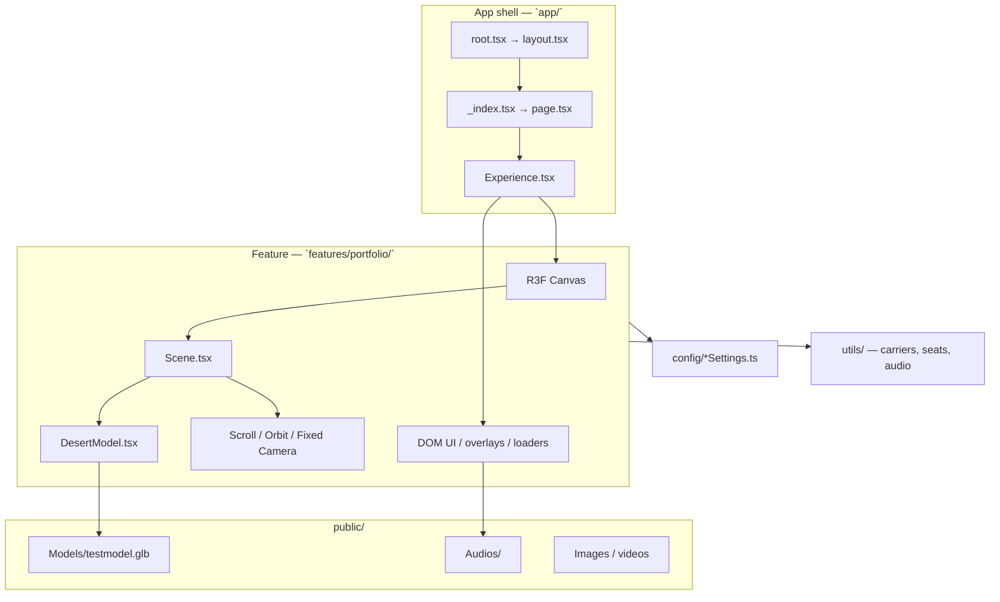
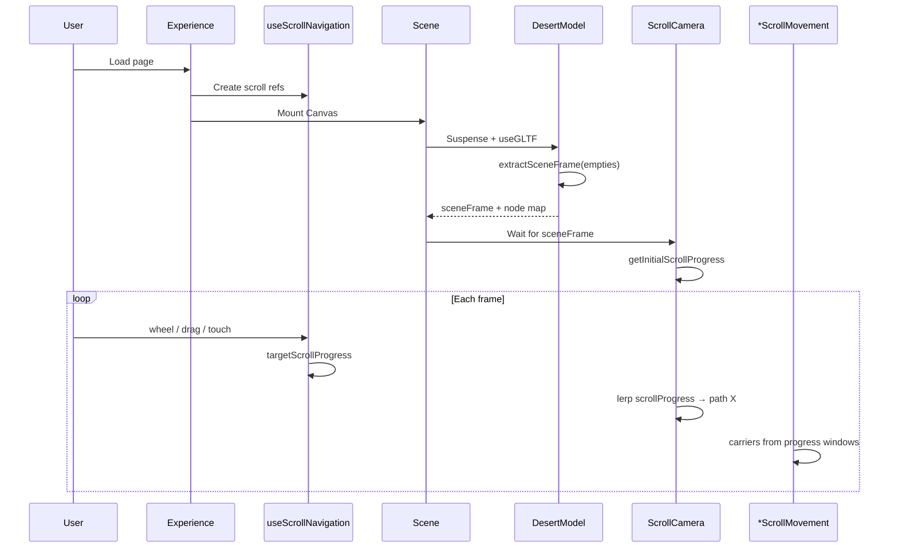
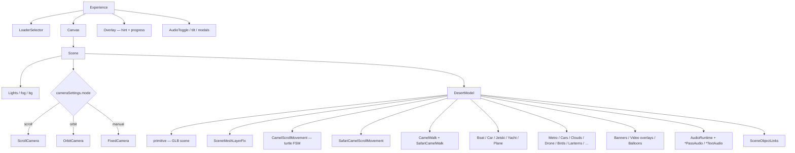
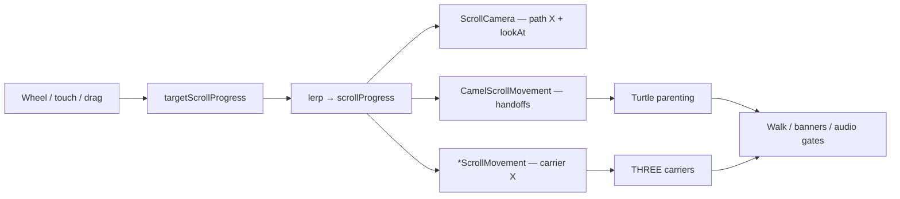
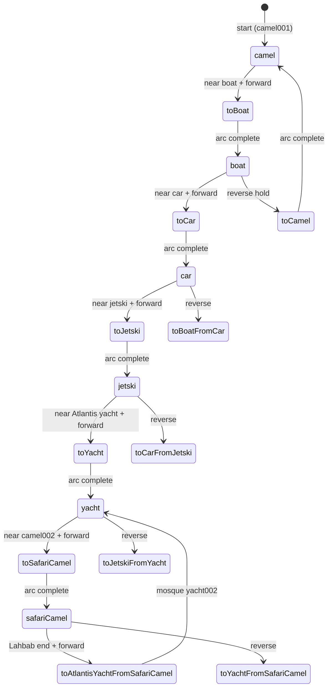
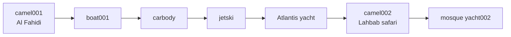
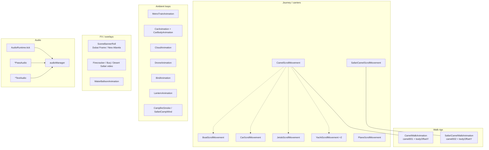
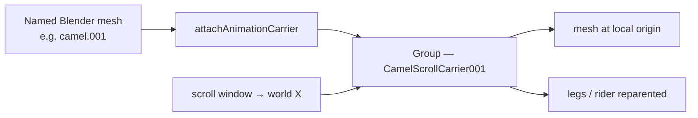
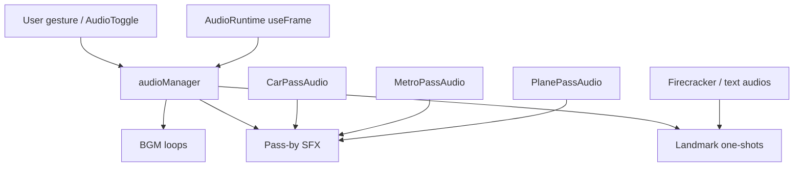
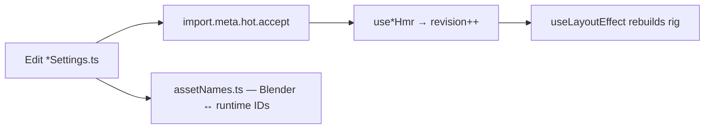

# Desert Portfolio — System Design

Remix SPA (`ssr: false`) + React Three Fiber. A scroll-scrubbed 3D diorama: Blender empties define the camera path; named meshes become **carriers** driven by scroll progress; the **turtle** is handed between seats by a central FSM.

---

## 1. High-level architecture



---

## 2. Repository layout

```
code/
├── app/                         # Remix SPA shell
│   ├── root.tsx / layout.tsx
│   ├── routes/_index.tsx → page.tsx → Experience
│   └── entry.client.tsx
├── features/portfolio/
│   ├── components/
│   │   ├── Experience.tsx       # Canvas + shell UI
│   │   ├── scene/               # DesertModel, Scene, Overlay, links
│   │   ├── camera/              # ScrollCamera, CameraPath
│   │   ├── animations/          # carriers, walks, banners, video
│   │   ├── audio/               # pass-by + landmark cues
│   │   ├── loading/             # LoaderSelector
│   │   └── ui/                  # AudioToggle, modals, tilt
│   ├── config/                  # Tunables + assetNames
│   ├── hooks/                   # scroll, audio, HMR, device
│   └── utils/                   # carriers, tracks, seats, audioManager
└── public/
    ├── Models/                  # GLB diorama
    ├── Audios/
    └── Images/
```

---

## 3. Runtime boot sequence



**Scroll semantics:** progress ≈ `1` at scene-1 entrance (high world X). Forward scroll decreases progress toward western scenes (low X). `SCROLL_DIRECTION = -1`.

---

## 4. Scene component hierarchy



---

## 5. Core data flow (one frame)



Shared refs (owned by `DesertModel`, consumed by systems):

| Ref family | Purpose |
|------------|---------|
| `scrollProgress` / `targetScrollProgress` | Camera + travel scrubbing |
| `turtleOn*Ref` | Which seat owns the turtle |
| `*TravelProgressRef` | Boat / car / jetski / yacht / safari progress |
| `isScrollLocked` | Journey CTA / transfer locks |
| `carPassState` | Mutable blackboard for mid-arc docks (no React re-render) |

---

## 6. Turtle journey — state machine

`CamelScrollMovement` owns parenting. Vehicles move independently; they park when `carPassState.*Transfer` is true.

### Mounts

`camel` → `boat` → `car` → `jetski` → `yacht` → `safariCamel` (+ transient `transfer`)

### Transfer modes



### Forward journey map



Each transfer: detach turtle → temporary `transferCarrier` → eased arc (`transferArcHeight` / duration) → `mountTurtleOn*` → sync refs + `carPassState`.

---

## 7. Major systems map



---

## 8. Carrier pattern



**Why world-space body offsets:** `camel.001` / `camel.002` carry **negative Blender scale**. The carrier inherits it, so a local `position.y -= n` moves the body **up**. Tunables:

| Camel | Config | Key |
|-------|--------|-----|
| camel001 | `camelScrollSettings.ts` | `bodyOffsetY` (world, negative = down) |
| camel002 | `endCamelScrollSettings.ts` | `bodyOffsetY` (world, negative = down) |

Shared geometry helpers live in `utils/sceneObjectUtils.ts`: find objects, floors, tracks, carriers, `setObjectWorldPosition`.

---

## 9. Audio pipeline



---

## 10. Config + HMR model



| Area | Config module (examples) |
|------|--------------------------|
| Naming | `assetNames.ts` |
| Camera | `cameraSettings.ts` |
| Scene-1 camel | `camelScrollSettings.ts`, `camelWalkSettings.ts` |
| Safari camel | `endCamelScrollSettings.ts` |
| Vehicles | `boat*`, `car*`, `jetski*`, `yacht*`, `plane*` |
| Ambient | `metroTrainSettings`, `bird*`, `lantern*`, `drone*`, `cloud*` |
| FX | `dubaiFrameBanner*`, `newAtlantisBanner*`, `firecracker*`, `burj*` |
| Audio | `audioSettings.ts` |
| Journey / CTA | `journeySettings.ts`, `sceneLinkSettings.ts` |

---

## 11. Cross-cutting concerns

| Concern | Mechanism |
|---------|-----------|
| Mesh IDs | `assetNames.ts` — single source for Blender vs loader names |
| Negative scale | World-space transforms via `setObjectWorldPosition` |
| Mid-transfer docking | `carPassState` blackboard |
| Device UX | `useDeviceType`, tilt prompt, iOS standalone helpers |
| Clickable mesh links | `SceneObjectLinks` + `sceneLinkSettings` |
| Protect / inspect | `useInspectProtection`, `assetProtectionSettings` |

---

## 12. Mental model

> **Scroll-scrubbed diorama.** Blender empties → camera X range. Named meshes → **carriers** driven by progress windows. The **turtle** is a reusable seat attachment driven by one FSM in `CamelScrollMovement`, coordinated through **refs + `carPassState`** so boat / car / jetski / yacht / safari camel move without fighting over the character graph.
